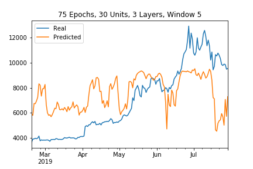
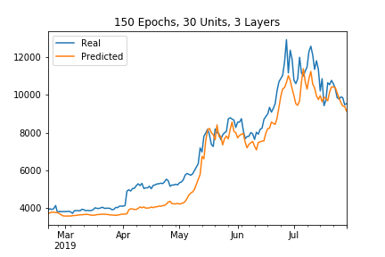

# Crypto Deep Learning

Using deep learning recurrent neural networks to model bitcoin (BTC) closing prices with two models. One model will use the Fear and Greed Index (FNG) to predict the closing price while the second model will use a window of closing prices to predict the nth closing price.

## FNG Model

For the FNG model, I experimented with multiple window sizes and epochs to determine the most accurate inputs for the model. I began with a window size of 10 and tested that with the number of epochs being 75, 100, and 150. Afterwards, I adjusted the window size to 5 and tested that with the same three different epoch amounts.

As I increased the number of epochs from 75 to 100 to 150 with a constant window of 10, I noticed the results vary. The first model with 75 epochs had a loss of 0.08286282420158386. The next model 100 epochs had a slightly better result with a loss of 0.07430987060070038. However, the model with 150 epochs resulted in a slightly higher loss of 0.0819598063826561.

To determine what the effect of changing the window size, I tried the model with a window of 5. I found that as the number of epochs decreased, the amount of loss also decreased.

Ultimately, the model with 75 epochs and a window of 5 had the best evaluation with a loss of only 0.06471779942512512.

## Closing Price Model

For the model based on closing prices, I followed a similar approach as done with the FNG model.

In this model, I found that when using a window of 5 the resulting amount of loss was fairly consistent (75 epochs: 0.010740832425653934, 100 epochs: 0.010727162472903728, 150 epochs: 0.010144814848899841).

Unlike the FNG model, the closing price model performed slightly better with a window of 10.

In the end, the model using 150 epochs and a window of 10 resulted in lowest loss amount (0.007703348994255066).

## Evaluating the Results

1. Which model has the lower loss?
   1. The closing price model resulted in the lowest loss.
2. Which model tracks the actual values better over time?
   1. The closing price model tracks the actual values better over time as can be seen in the graphs above.
3. Which window size works best for the model?
   1. The closing price model appeared to work best with a window size of 10. (*note: for the FNG model, a window size of 5 appeared to work better*)
